# 完整界面预览

[返回素材索引](../README.md) · [返回项目首页](../../README.md)

供 UI 负责人和前端开发协作参考，共 **15 张**，包含首页、读者流程、作者流程、管理界面以及状态和组件规范。每张图片均保留原始尺寸，点击可查看原图。

> 以下为用户提供的生成设计稿，人物、故事、社区数字及真实性声明均为虚构设计示例，不代表当前运行界面或真实运营数据。业务规则以 [PRD](../../docs/PRD.md) 和 [前端接入说明](../../docs/frontend-integration.md) 为准。

建议先看 01 首页与 15 组件总览，再按业务流程阅读；13、14 用于补齐状态与弹层。

## 01 · 发现页 · 首页

[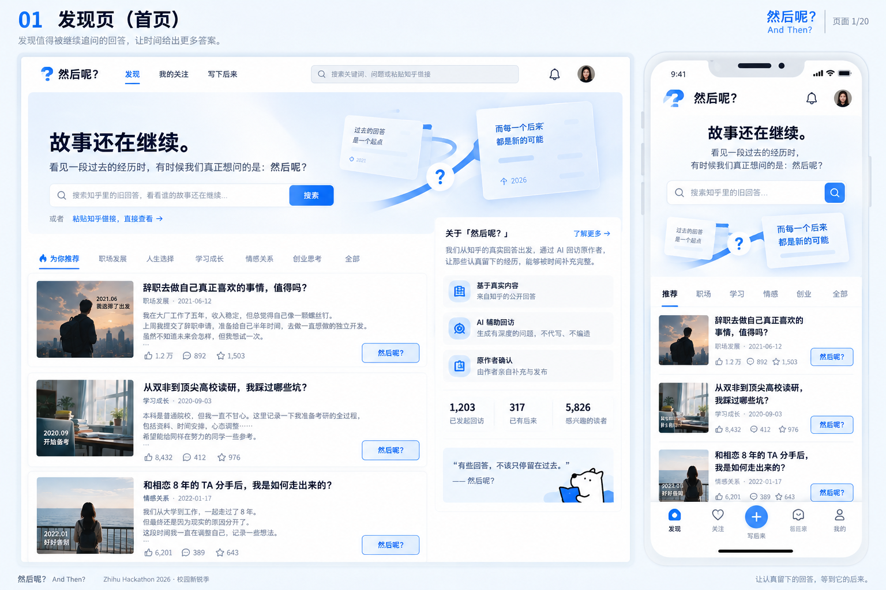](01_发现页_首页.png)

## 02 · 故事详情页 · 读者端

[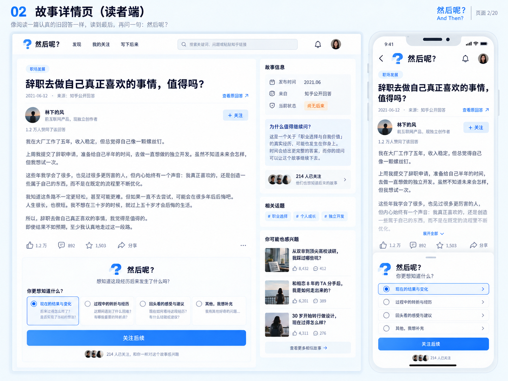](02_故事详情页_读者端.png)

## 03 · 我的关注页 · 读者端

[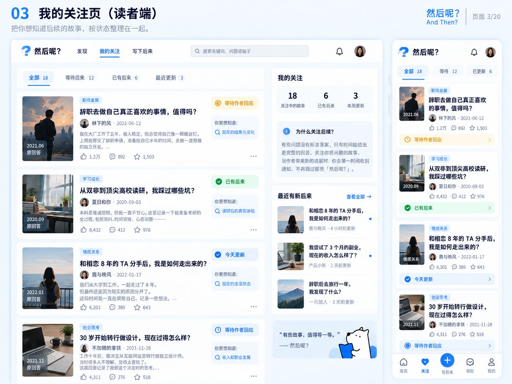](03_我的关注页_读者端.png)

## 04 · 通知页 · 读者端

[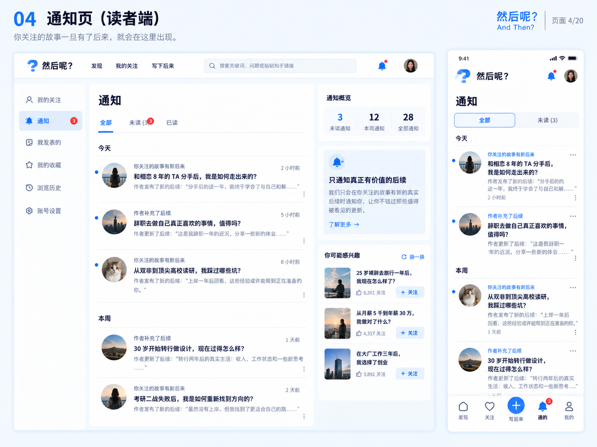](04_通知页_读者端.png)

## 05 · 写下后来 · 作者端

## 06 · AI回访采访页 · 作者端

[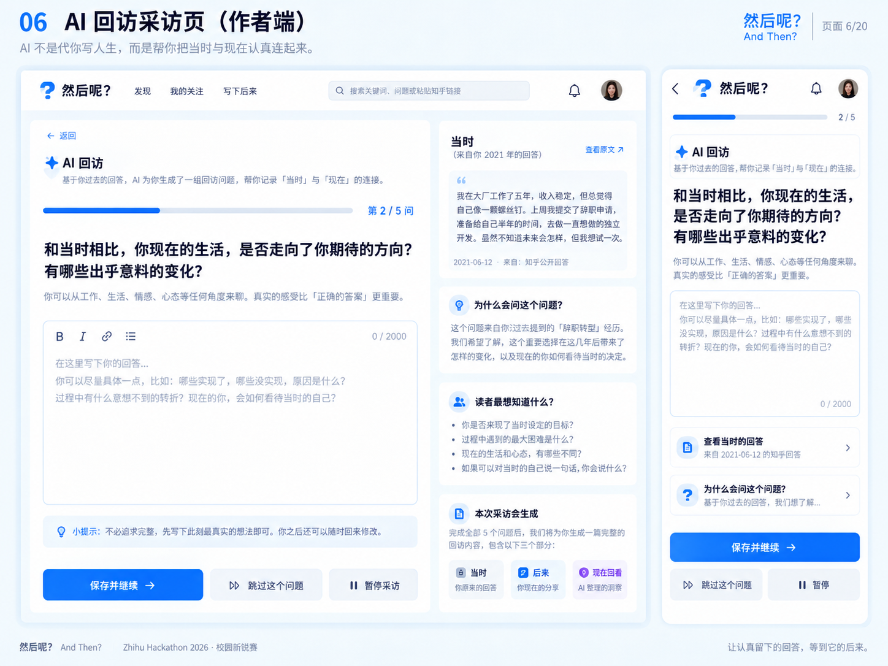](06_AI回访采访页_作者端.png)

## 07 · 确认与发布页 · 作者端

[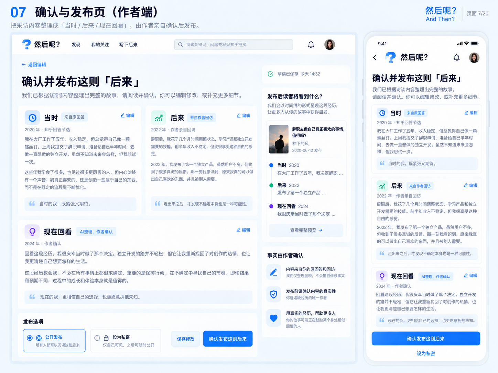](07_确认与发布页_作者端.png)

## 08 · 公开后来页 · 阅读页

[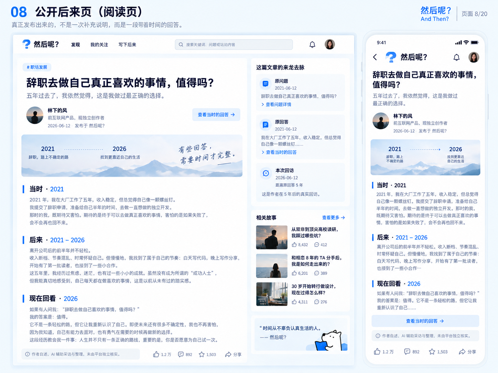](08_公开后来页_阅读页.png)

## 09 · 我的页 · 设置与资料

[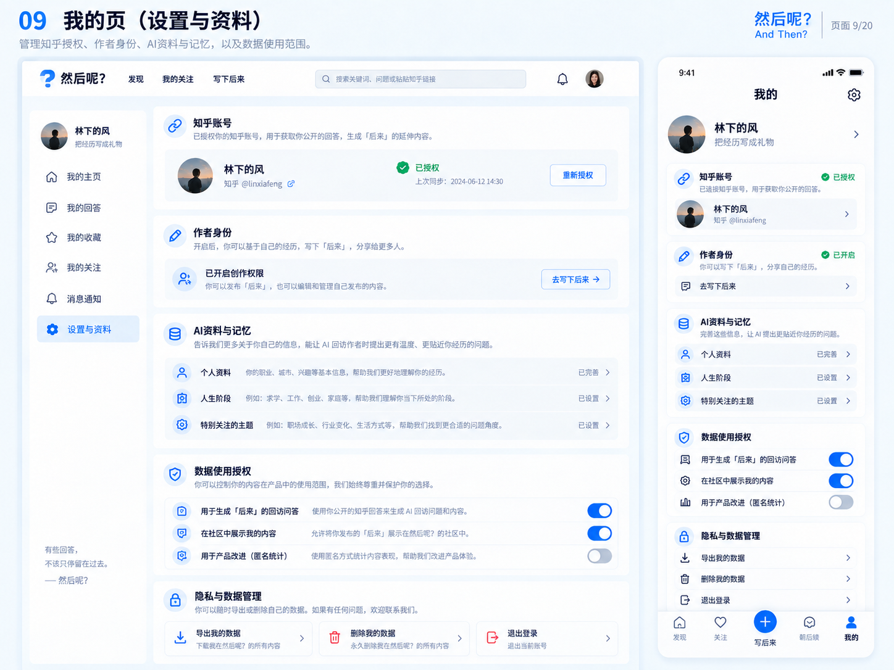](09_我的页_设置与资料.png)

## 10 · 管理后台 · 内部

[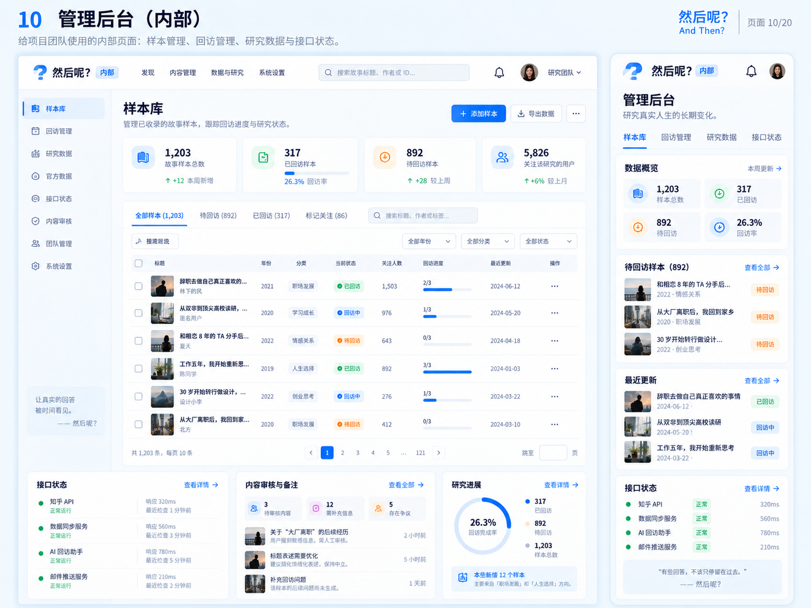](10_管理后台_内部.png)

## 11 · 作者邀请与参与确认

[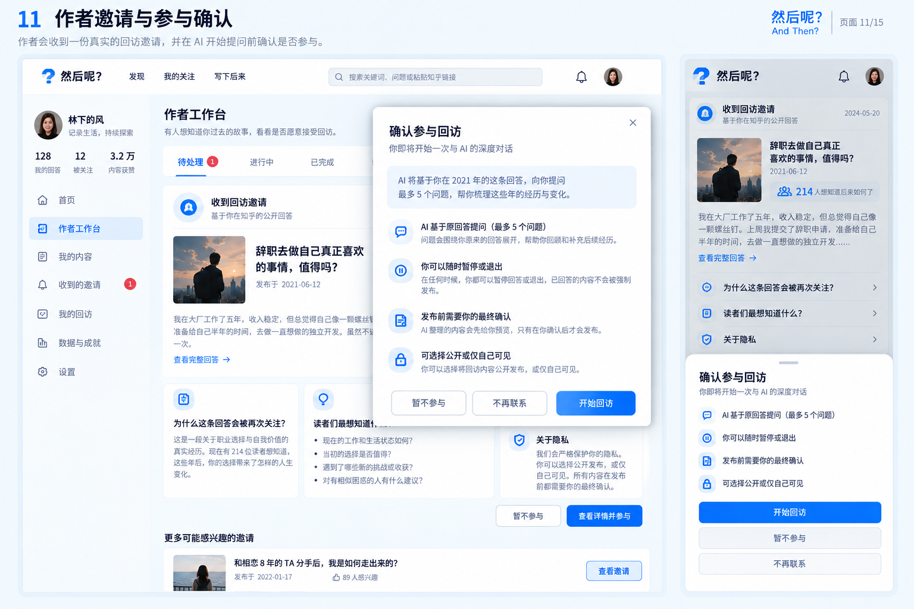](11_作者邀请与参与确认.png)

## 12 · 链接导入与来源核验

[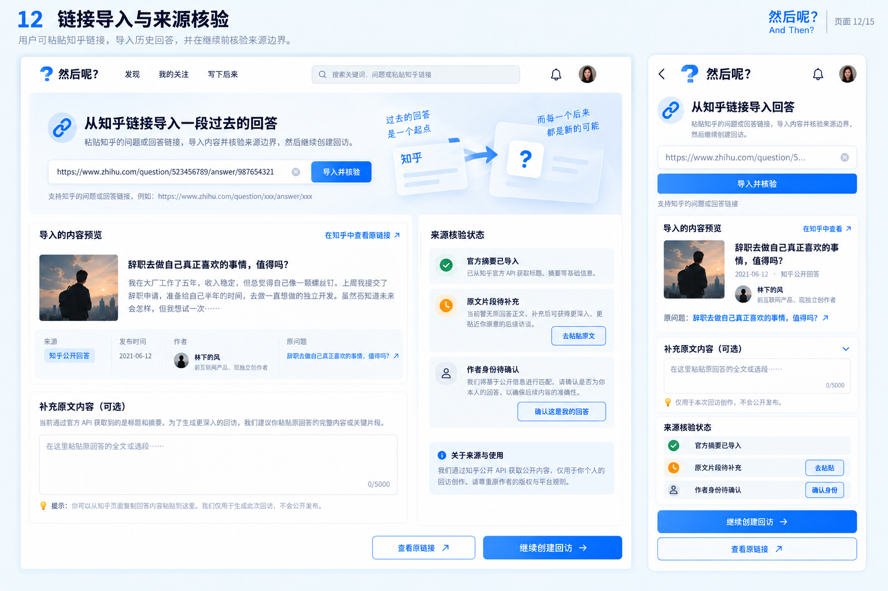](12_链接导入与来源核验.png)

## 13 · 状态与空态规范

[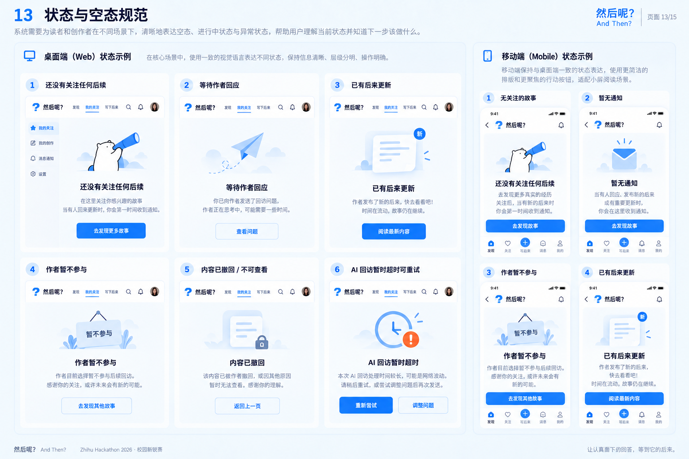](13_状态与空态规范.png)

## 14 · 弹窗 · BottomSheet · Drawer规范

[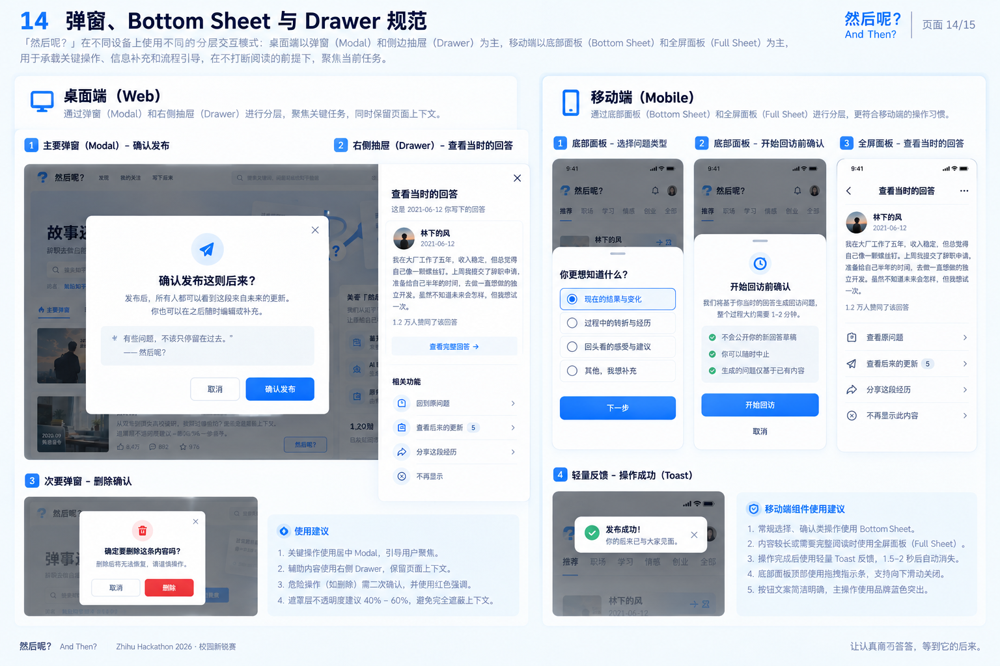](14_弹窗_BottomSheet_Drawer规范.png)

## 15 · DesignSystem · 组件总览

[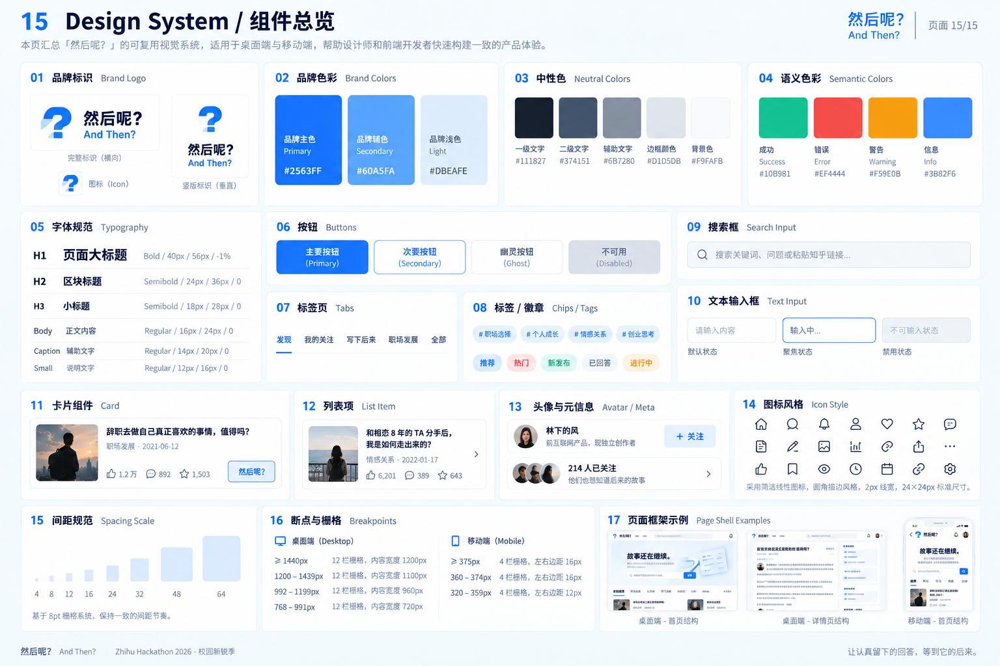](15_DesignSystem_组件总览.png)
