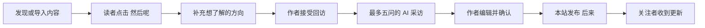

<div align="center">

# 然后呢？
### 让认真留下的回答，等到它的后来。

**AndThen · 从一篇旧回答，到一段新的真实经历**


[产品需求](docs/PRD.md) · [运行 Demo](#运行-demo) · [前端接入](docs/frontend-integration.md) · [团队协作](CONTRIBUTING.md) · [接口文档](docs/openapi.json)

</div>

---

## 故事不该停在回答发布的那一天

“我给自己半年时间转行。”

几年后，读者还会找到这篇回答：**后来怎么样了？当时的选择，今天还认同吗？**

「然后呢？」把这份好奇变成一次有边界的回访：读者关注后续，作者接受邀请，AI 帮忙提出值得展开的问题。作者确认自己的文字后，一段新的“后来”回到读者面前。

这是一个独立网站的功能 Demo，以知乎官方能力作为内容入口；不是知乎官方产品，也不自动向知乎发文或私信。

## 一条完整的体验



| 给读者 | 给作者 | 给团队 |
|---|---|---|
| 搜索、导入与发现旧内容 | 查看回访与关注方向 | 可复用的 React 功能页面 |
| 关注后续、补充疑问 | 根据每个问题写一小篇经历 | OpenAPI 与接口契约 |
| 阅读问题和分段回答 | 查看依据、确认、发布和撤回 | 后台任务、测试与迁移 |
| 接收站内更新通知 | 控制资料同意与作者记忆 | PRD、验收记录与协作规范 |

## AI 在哪里起作用？

- **采访准备**：从允许使用的材料中整理信息；memU 检索相关作者记忆，帮助提问，拒谈偏好始终作为约束。
- **读者选题**：三个预设方向直接统计；自定义疑问结合该帖已有标签进行语义归类，再汇总人数与比例。
- **五问采访**：保持一问一答，邀请作者讲清经历和转折。第五问在尚未覆盖时邀请作者对相似处境的读者说些话，已经谈过就避免重复。
- **可确认的后来**：原问题和作者回答一起进入草稿；排版不编造事实，公开内容始终需要作者确认。

## 当前能做什么

| 范围 | 状态与边界 |
|---|---|
| 本地读者 → 作者 → 发布 → 通知 | 已完成浏览器流程验证；试玩故事明确标记为虚构 |
| 官方搜索、链接解析与关注 | 已接入；取得摘要时只展示摘要，不冒充全文 |
| 作者记忆与真实模型 | 已完成项目接入与真实联调；需要自行配置凭证 |
| 评论 | 仅在官方允许范围内单向同步，不保证完整评论覆盖 |
| OAuth 作者绑定 | 接口已实现；真实授权验收仍取决于赛事 App ID / App Key 等外部条件 |
| 公共网站 | 仓库公开不等于网站已部署；服务器、域名与正式运营待配置 |

可验证范围与限制见 [验收矩阵](docs/acceptance-matrix.md)。测试通过不代表采访质量或生产容量已获保证。

## 运行 Demo

需要 Git、Docker 与 Docker Compose。首次构建需要能访问镜像和依赖源。

```bash
git clone https://github.com/Normaluncle/AndThen.git
cd AndThen
cp .env.example .env.local
```

Windows PowerShell 用 `Copy-Item .env.example .env.local` 替代 `cp` 也可以。

在 `.env.local` 配置自己的服务凭证，详见 [团队启动说明](docs/team-quickstart.md)。仓库不包含团队密钥、作者资料或数据库。

```bash
docker compose --env-file .env.local -p andthen-v12-demo -f docker-compose.yml -f docker-compose.demo.yml up -d --build
```

然后打开 **http://127.0.0.1:5174**，接口说明在 **http://127.0.0.1:8082/docs**。创建固定的虚构试玩材料、切换作者/读者的方法见 [启动说明](docs/team-quickstart.md)。

> 未配置模型或官方凭证时，相应能力会提示不可用；不会伪造成功结果。本地试玩登录仅用于本机，不能原样暴露到公网。

## 给第一次协作的队友

1. **先看需求**：[完整 PRD](docs/PRD.md)，修改需求时保留原章节并做增量更新。
2. **认领任务**：开一个 Issue，说明要解决什么、如何判断完成。
3. **各自开分支**：前端、后端、文档分别推进，避免直接同时修改主分支。
4. **提交 PR**：写清变化与验证，请另一位队友审阅后合并。

详细操作、角色分工与冲突处理见 [CONTRIBUTING.md](CONTRIBUTING.md)。公开访问者可以查看和下载未修改副本用于阅读；修改和团队开发需要明确授权，公开或 Fork 不代表获得修改、再分发或商用许可。

## 工程地图

```text
src/                  后端业务、权限、AI 任务与队列
  modules/            来源、关注、回访、采访、发布等模块
  db/migrations/      数据库增量迁移
services/memory/      Python + memU 作者记忆服务
demo/                 React / Vite 功能 Demo
tests/               单元、业务与真实 PostgreSQL 集成测试
docs/                 PRD、契约、验收和接入说明
```

技术栈：Node.js 24 / TypeScript / Fastify 5 / PostgreSQL 18 / Drizzle / React / Vite / memU。

后端开发入口：[BACKEND.md](BACKEND.md) · [架构](docs/architecture.md) · [契约](docs/contracts.md)。

## 展示素材

欢迎补充封面与流程截图。已准备 [素材尺寸与内容建议](docs/assets/README.md)，提供图片后可以直接嵌入这里，不需要重做 README 结构。

## 许可与内容归属

项目采用[保留所有权利与团队开发授权](LICENSE)，不向外部授予修改、再分发或商用许可。经明确授权的队友可为本项目开发协作。第三方依赖及内容遵循各自许可；此前已有效授予的 MIT 许可不因本次变更被追溯撤销。

<div align="center">

**读者问一句「然后呢？」 · 作者留下自己的「后来」。**

</div>
