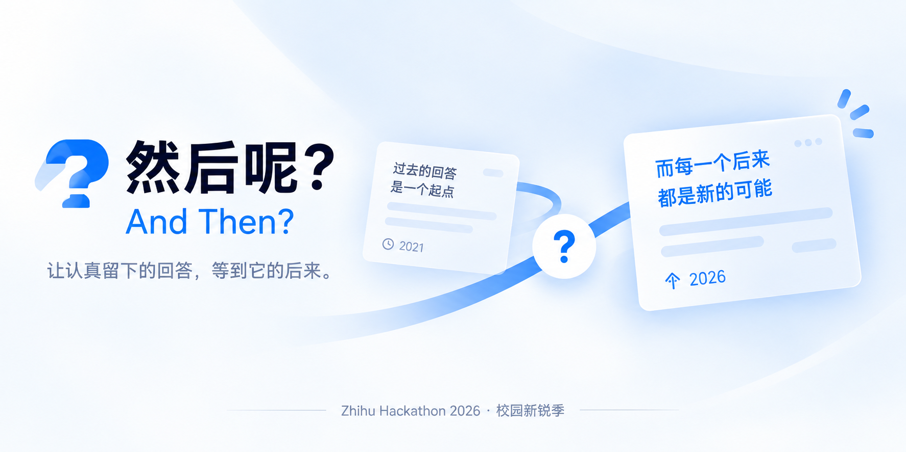
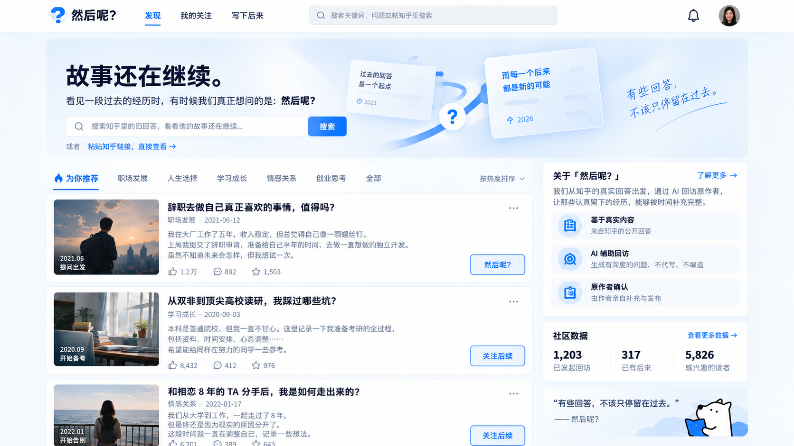
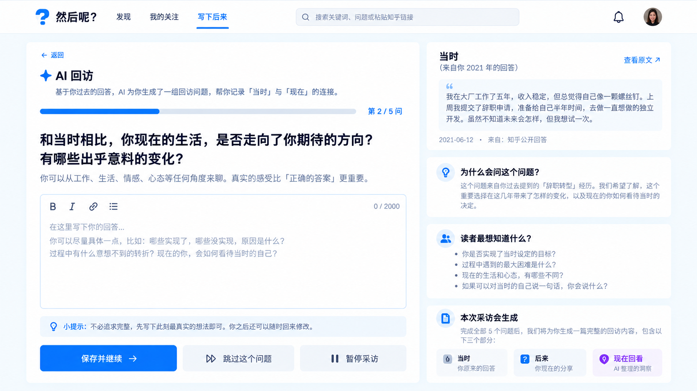
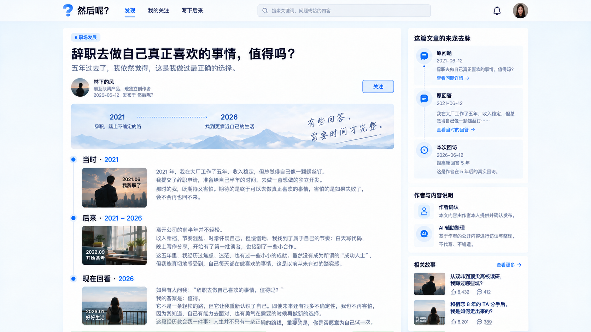

一个连接旧回答与后续经历的独立网站 Demo：读者关注故事，AI 辅助回访，作者编辑、确认并在本站发布。

[运行 Demo](#运行-demo) · [产品需求](docs/PRD.md) · [前端设计参考](AndThen_UI_and_Assets_24/README.md) · [开发文档](BACKEND.md)

## 故事不该停在回答发布的那一天

“我给自己半年时间转行。”

几年后，读者还会找到这篇回答：**后来怎么样了？当时的选择，今天还认同吗？**

「然后呢？」把这份好奇变成一次有边界的回访。作者决定是否参与、谈什么，以及哪些内容可以公开；读者在故事更新时收到站内通知。

## 从一句追问，到一段后来

> 以下三张为 AI 生成的界面概念稿，用于说明设计方向；人物、故事、日期、社区数字及图内“真实回访”等文字均为设计示例，不代表真实作者材料、运营数据或当前 Demo 的实际界面。功能范围见[验收矩阵](docs/acceptance-matrix.md)。

### 01 · 发现一个还想追问的故事

从搜索或链接导入开始，关注旧回答的后续，也可以补充自己最想了解的方向。



### 02 · 让作者讲述这些年的变化

作者接受回访后，AI 根据允许使用的材料辅助提问。最多五问，一问一答，把经历和转折留给作者自己讲述。



### 03 · 等到故事的后来

作者编辑并确认内容后，在本站发布新的“后来”，关注者收到更新。



## AI 如何帮助这次回访

- **准备有依据的问题**：结合允许使用的原始材料与作者记忆，同时遵守拒谈偏好。
- **理解读者的好奇**：汇总关注方向，对自定义疑问进行语义归类。
- **保留作者的表达**：辅助采访与整理，公开内容始终经过作者确认。

## 项目状态

当前为功能 Demo。已有功能与验收记录见[验收矩阵](docs/acceptance-matrix.md)；上面的概念图展示拟采用的视觉方向。

本项目独立开发，不是知乎官方产品；不自动向知乎发文或私信，发布发生在本站。真实平台授权仍有外部配置与验收条件，示例材料须标记为虚构。

## 运行 Demo

需要 Git、Docker 与 Docker Compose。首次构建需要能访问镜像和依赖源。

```bash
git clone https://github.com/Normaluncle/AndThen.git
cd AndThen
cp .env.example .env.local
```

Windows PowerShell 也可使用 `Copy-Item .env.example .env.local`。

在 `.env.local` 配置自己的服务凭证，详见[团队启动说明](docs/team-quickstart.md)。

```bash
docker compose --env-file .env.local -p andthen-v12-demo -f docker-compose.yml -f docker-compose.demo.yml up -d --build
```

打开 [本地 Demo](http://127.0.0.1:5174) 或[本地接口说明](http://127.0.0.1:8082/docs)。试玩材料和账号切换方式见[启动说明](docs/team-quickstart.md)。

未配置模型或官方凭证时，相应能力不可用。本地试玩登录仅用于本机；公网部署前需要另行配置。

## 继续了解

| 你想了解什么 | 从这里开始 |
|---|---|
| 产品目标与流程 | [PRD](docs/PRD.md) |
| 15 张前端参考图与 10 张视觉素材 | [完整素材索引](AndThen_UI_and_Assets_24/README.md) |
| 前端开发与接口 | [前端接入](docs/frontend-integration.md) · [OpenAPI](docs/openapi.json) |
| 后端结构与技术方案 | [后端说明](BACKEND.md) · [架构](docs/architecture.md) |
| 参与项目协作 | [贡献与协作约定](CONTRIBUTING.md) |

技术栈：Node.js 24 / TypeScript / Fastify 5 / PostgreSQL 18 / Drizzle / React / Vite / memU。

## 许可与内容归属

项目采用[保留所有权利与团队开发授权](LICENSE)。公开仓库不等于授予修改、再分发或商用许可；第三方依赖与内容遵循各自许可。

**读者问一句「然后呢？」 · 作者留下自己的「后来」。**

